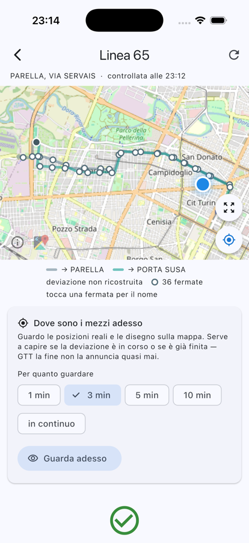

<div align="center">

# 🚏 DeviaTo

**Gli avvisi di deviazione di GTT (Torino) sono scritti in prosa.<br>
DeviaTo li trasforma in una mappa e risponde a una domanda sola:
la mia fermata è ancora servita?**

[](LICENSE)
[](#-installazione)
[](#-installazione)
[](https://flutter.dev)
[](#-sviluppo)
[](https://www.gtt.to.it/cms/openday/open-data)



</div>

---

## ✨ In breve

- 🔴 **Ti dice quali fermate saltano** — e dove andare al loro posto. È
  l'informazione che serve davvero, e che GTT non pubblica quasi mai.
- 🗺️ **Disegna la deviazione sulla mappa**, ricostruita dal testo
  dell'avviso: percorso normale, tratto deviato, fermate escluse.
- 🚌 **Guarda dove sono i mezzi adesso** e capisce se la deviazione è
  **già finita** — cosa che nessun'altra fonte sa dirti, perché GTT
  annuncia quando cominciano ma non quando smettono.
- 📅 **Separa ciò che è in corso da ciò che comincerà.** Il 19 % delle
  variazioni pubblicate non è ancora in vigore.
- 📵 **Nessun server.** Orari e calcoli stanno sul telefono. La tua
  posizione non lascia il dispositivo.
- 🤐 **Non inventa mai.** Se non riesce a ricostruire un percorso lo
  dichiara e ti mostra il testo originale di GTT.

## 📑 Indice

- [Il problema](#-il-problema)
- [Installazione](#-installazione)
- [Cosa fa](#-cosa-fa)
- [Come funziona](#-come-funziona)
- [Architettura](#-architettura)
- [Limiti noti](#-limiti-noti)
- [Sviluppo](#-sviluppo)
- [Licenze e attribuzioni](#-licenze-e-attribuzioni)

## 🎯 Il problema

L'avviso tipico di GTT si presenta così:

> *Linea 65 deviata in direzione corso Bolzano dalle 8:00 di lunedì 3 sino
> alle 18:00 di venerdì 7 agosto 2026. Da via Asinari di Bernezzo angolo
> corso Monte Grappa, per via Asinari di Bernezzo, piazza Chironi, via
> Medici, corso Lecce, via Lessona, segue percorso normale.*

È un elenco di vie. Ma chi aspetta il bus sta a una **fermata**, non su una
via, e per sapere se quella fermata è ancora servita dovrebbe ricostruire
il percorso a mente su una mappa che non ha davanti.

L'app fa quel lavoro: geocodifica i toponimi, calcola il percorso deviato
sulla rete stradale reale, lo confronta con il percorso ufficiale del GTFS
e determina quali fermate restano fuori.

> [!NOTE]
> **DeviaTo** — da «devia» e «To», che a Torino è come si scrive Torino.
> Progetto personale, non affiliato a GTT né approvato da GTT.

## 📲 Installazione

> [!IMPORTANT]
> **Qui c'è il codice sorgente, non un'app pronta.** Non ci sono APK né
> build da scaricare: DeviaTo va compilata. Non è pensata come prodotto
> per tutti — è un progetto personale, pubblicato perché il metodo possa
> servire a qualcun altro.

Requisiti: [Flutter](https://docs.flutter.dev/get-started/install), Dart ≥ 3.12.

```bash
git clone https://github.com/TCdesign-dev/gtt-deviazioni.git
cd gtt-deviazioni/app && flutter pub get && flutter run
```

Al primo avvio scarica il GTFS di GTT (24 MB) e lo riusa per una settimana.
Aggiungi le linee che ti interessano e tocca **Controlla**.

**Serve una chiave [OpenRouter](https://openrouter.ai/keys)** per leggere il
testo degli avvisi: si incolla nelle impostazioni e resta **solo sul
dispositivo**. Il modello predefinito è gratuito, con cinquanta richieste al
giorno.

### Stato delle due piattaforme

Detto com'è, perché non sono allo stesso punto:

**🍎 iOS — provata.** Girata a lungo sul simulatore: è lì che sono stati
trovati quasi tutti i difetti veri di questo progetto. Con un Apple ID
gratuito la firma scade dopo sette giorni e va rifatta; per installarla ad
altri serve il programma a pagamento di Apple.

**🤖 Android — mai compilata.** Il codice è lo stesso e la configurazione è
stata controllata a mano (Java 17 impostato, permessi di posizione nel
manifest, `geolocator` che non alza il `minSdk`), ma `flutter build apk`
non è mai stato lanciato: sulla macchina di sviluppo c'è solo Java 8.
Quindi «funziona su Android» è un'ipotesi ragionevole, non un fatto. Serve
un JDK 17+ e le licenze dell'SDK accettate:

```bash
flutter doctor --android-licenses && flutter build apk
```

Se lo provi e non compila, [aprire una issue](https://github.com/TCdesign-dev/gtt-deviazioni/issues)
è il contributo più utile che si possa fare adesso.

> [!IMPORTANT]
> **Privacy.** La posizione, se la attivi, non lascia il dispositivo: non
> viene salvata e non compare in nessuna richiesta di rete. I servizi
> esterni ricevono i toponimi degli avvisi e il percorso della linea, mai
> dove sei tu. Il permesso viene chiesto quando tocchi il pulsante, non
> all'apertura della schermata.

## 🧭 Cosa fa

### 🔴 Fermate non servite e alternative

L'output più utile, e quello che GTT non fornisce quasi mai. Le alternative
privilegiano le fermate ancora servite dalla **stessa linea**, così da non
richiedere un cambio di mezzo.

### 🌐 Mappa

Percorso normale di entrambe le direzioni con tonalità distinte, tratto
deviato in rosso, fermate toccabili per il nome, fermate saltate cerchiate,
e la tua posizione su richiesta.

### 🚌 Osservazione dei mezzi in tempo reale

Da un minuto a dieci, oppure in continuo, con i veicoli che si aggiornano
sulla mappa. **Continua mentre guardi altre linee** — una alla volta, per
non raddoppiare le richieste al feed di GTT. Risponde a una domanda che nessun'altra fonte copre — **la
deviazione è già finita?** — e a una che il testo non sa rispondere bene:
**dove escono e dove rientrano davvero**. L'app lo dice con i nomi delle
fermate, e disegna il tratto realmente percorso. È l'unico dato del
sistema che non viene da un testo di GTT.

### 📅 In corso oppure in programma

Il 19 % delle variazioni pubblicate non è ancora in vigore. L'app le tiene
separate — *«comincia dopodomani»* — invece di segnalarle come attive.

### ⚡ Controllo per singola linea

La quota gratuita è di cinquanta richieste al giorno: ricontrollare tutta la
watchlist per sapere di una linea sola sarebbe uno spreco misurabile.

### 📄 Testo originale sempre visibile

In fondo a ogni scheda, così che il dato grezzo resti disponibile anche
quando il sistema sbaglia.

## 🧩 Come funziona

Il passaggio da testo a geometria è il punto in cui questi progetti si
fermano. Un geocoder interrogato liberamente con «via Roma» restituisce
decine di risultati in tutto il Piemonte, e la polilinea che ne esce non ha
alcun rapporto con il percorso reale della linea.

La soluzione è il **geocoding vincolato**: i toponimi si cercano
esclusivamente entro un chilometro dal percorso ufficiale di *quella* linea.
È questo vincolo — non il modello linguistico, non l'euristica — a rendere
affidabile l'intera catena.

### 📊 Le misure, sui dati reali di GTT

| Grandezza | Valore |
|---|---|
| Toponimi risolti correttamente | **150 / 150** entro 2 km |
| Distanza massima di un toponimo corretto dal percorso | **800 m** |
| Distanza minima di una via **estranea** alla linea | **1342 m** |
| Estrazione strutturata dal testo (LLM) | **34 / 34**, zero toponimi inventati |
| Copertura della tabella alias dei nomi di linea | **98,4 %** (63/64) |

Il margine fra 800 m e 1342 m è ciò che rende il filtro possibile: un
toponimo corretto e uno estraneo si separano nettamente, e il buffer di 1 km
cade in mezzo. Un buffer da 2 km lascia entrare rumore; uno da 500 m scarta
vie legittime, perché una deviazione per definizione si allontana.

### 🔗 La catena

```
avvisi GTT (due fonti)
        │
        ▼
  unione dei doppioni ......... 31 coppie su 189 avvisi
        │
        ▼
  estrazione LLM .............. testo → JSON (vie, direzione, tipo)
        │
        ▼
  geocoding VINCOLATO ......... toponimi → coordinate, entro 1 km dalla linea
        │
        ▼
  routing bus (Valhalla) ...... coordinate → polilinea sulla rete reale
        │
        ▼
  cinque validazioni .......... o si dichiara l'incertezza
        │
        ▼
  impatto sulle fermate ....... quali saltano, dove andare al loro posto
```

Il percorso ricostruito supera **cinque validazioni** prima di essere
disegnato. Se una fallisce, l'app dichiara l'incertezza e mostra il testo di
GTT. La regola è esplicita:

> ⚠️ **Meglio nessuna mappa che una mappa sbagliata.** Un falso positivo fa
> camminare l'utente ottocento metri inutilmente, e distrugge la fiducia
> nello strumento.

## 🧱 Architettura

Il sistema è organizzato attorno a un vincolo strutturale:

> **`app/lib/core/` è Dart puro.** Nessun `import 'package:flutter/…'`.

Da questo discende il resto: la logica si esegue e si testa in millisecondi
senza simulatore, si può invocare da riga di comando, e l'interfaccia è
sostituibile — con un'altra UI, con uno script, con un'implementazione
nativa — senza toccare il calcolo. Se un file di `core/` avesse bisogno di
Flutter, quel file sarebbe nel posto sbagliato.

```
app/lib/
├── core/                       ← Dart puro, zero dipendenze da Flutter
│   ├── config.dart             ← tutte le soglie tarabili, in un posto solo
│   ├── models/                 ← tipi di dominio, senza comportamento di rete
│   ├── geo/
│   │   ├── projection.dart     ← gradi ↔ metri
│   │   ├── geometry.dart       ← distanze, proiezioni, Fréchet, densify
│   │   └── polyline.dart       ← codifica Google polyline
│   ├── gtfs/                   ← scarico e indicizzazione del GTFS statico
│   ├── sources/                ← una classe per fonte GTT, intercambiabili
│   ├── llm/                    ← client OpenAI-compatibile
│   └── pipeline/               ← un passaggio del calcolo per file
│       ├── notice_merge.dart   ← le due fonti → un avviso solo
│       ├── line_resolver.dart  ← «55» → 55U (tabella alias)
│       ├── extractor.dart      ← testo → JSON strutturato (LLM)
│       ├── geocoder.dart       ← toponimo → coordinate, VINCOLATO
│       ├── route_builder.dart  ← vie → polilinea (Valhalla) + validazioni
│       ├── rejoin_inference.dart ← dove rientra, quando GTT non lo dice
│       ├── stop_impact.dart    ← quali fermate saltano, e le alternative
│       └── vehicle_watch.dart  ← osservazione dei mezzi in tempo reale
├── data/                       ← persistenza, orchestrazione, posizione
└── ui/                         ← schermate e mappa
```

**Perché è diviso così.** Ogni file di `pipeline/` è un passaggio del
ragionamento ed è sostituibile isolatamente: se Photon cessa il servizio si
riscrive `geocoder.dart`; se Valhalla pubblico sparisce, `route_builder.dart`;
per cambiare modello linguistico, `extractor.dart`. Nessun altro file se ne
accorge.

`config.dart` esiste perché quasi tutte le soglie vanno tarate sul campo. I
valori marcati `MISURATO` vengono da rilevazioni reali, e in **sette casi
contraddicono** le stime del progetto originale — fra cui la soglia di
fuori-rotta (50 m misurati contro 80 stimati) e il buffer del geocoding
(1 km contro 2).

### 🔌 Fonti dati

| Fonte | Uso | Nota |
|---|---|---|
| GTFS statico GTT | percorsi, fermate, orari | rigenerato ogni giorno alle 04:00, CC-BY |
| `alerts.aspx` (GTFS-RT) | avvisi | porta il `route_id` canonico nel 96,7 % dei casi |
| `/cms/variazioni` (HTML) | avvisi | unica fonte con le **date d'inizio reali** |
| `vehicle_position.aspx` | posizioni dei mezzi | si spegne di notte, il servizio no |
| [Photon](https://photon.komoot.io/) | geocoding | nessuna chiave richiesta |
| [Valhalla](https://valhalla1.openstreetmap.de/) (FOSSGIS) | routing `costing: bus` | polilinee a precisione 6 |
| [OpenRouter](https://openrouter.ai) | estrazione dal testo | chiave dell'utente, sul dispositivo |

L'OTP di GTT — che il progetto originale indicava come fonte primaria — è
stato scartato dopo verifica: espone un build più vecchio, i cui `trip_id`
non esistono nel feed corrente, e a cui mancano sette linee.

## 🚧 Limiti noti

### 🔕 Non ti avvisa da sola: devi aprirla tu

L'app controlla GTT solo quando gliela chiedi. Non c'è modo di farlo in
sottofondo: iOS chiude le app che ci provano, e l'unica alternativa
sarebbe un server sempre acceso — che è proprio la cosa che questo
progetto evita, per non dover dipendere da niente e da nessuno.

### 📏 Le distanze a piedi sono in linea d'aria

Quando una fermata salta, l'app ti propone quelle vicine e ti dice quanto
distano — ma in linea retta, come vola un uccello, non come cammini tu. A
Torino un fiume, una ferrovia o un muro possono raddoppiare il percorso
reale. L'app scrive «in linea d'aria» ogni volta, così il numero non si
scambia per una distanza a piedi.

### 🔀 Usa il percorso principale della linea

La stessa linea ha spesso più percorsi leggermente diversi: alcune corse
si fermano prima, altre passano da una via invece che da un'altra. L'app
usa quello più frequente. Se una deviazione riguardasse **soltanto** una
di quelle corse minori, l'app la calcolerebbe come se valesse per tutte.

### 📆 Le date di inizio le dà una fonte sola

GTT pubblica gli avvisi in due posti, e in uno dei due la data di inizio
non è quella vera: è l'ora in cui l'avviso è stato scritto. L'abbiamo
verificato su 161 avvisi, e in 161 casi su 161 era così. L'app prende
quindi le date dall'altra fonte, la tabella del sito, che le ha in una
colonna apposta. Quando una variazione compare **solo** nel primo posto,
la sua data d'inizio resta inaffidabile.

## 🧪 Sviluppo

```bash
cd app && flutter test      # 234 test
cd app && flutter analyze
```

I test sulle fonti girano **offline su dati reali**: il feed protobuf e la
pagina HTML di GTT del 31 luglio 2026 stanno in `app/test/fixtures/`. I test
sul GTFS si saltano da soli se i file non ci sono.

Strumenti di misura, che interrogano i servizi veri:

```bash
cd app && dart run tool/check_pipeline_live.dart     # catena completa
cd app && dart run tool/check_merge_offline.dart     # unione delle fonti
```

> [!TIP]
> **Prima di modificare qualcosa, leggi [`CLAUDE.md`](CLAUDE.md).** Contiene
> ciò che non sta nel codice: le misure e il metodo con cui sono state
> ottenute, il ragionamento dietro le scelte, i sette punti in cui la
> specifica originale è stata smentita dai dati, e le trappole già pagate —
> per esempio il confronto per sottostringhe che faceva scattare «lavori
> **strada**li» sul capolinea «**STRADA** del Drosso», mandando l'avviso
> sulla direzione sbagliata.

Due criteri per i contributi:

1. **Le soglie si tarano misurando.** Gli script in `scripts/` e `app/tool/`
   esistono per questo. Un numero rimesso in discussione va rimisurato, non
   stimato.
2. **Dichiarare l'incertezza è un requisito, non un ripiego.** «Non lo so» è
   una risposta valida e va comunicata come tale.

**Altra documentazione:** [`app/ARCHITETTURA.md`](app/ARCHITETTURA.md) per lo
stato dei moduli · [`docs/FASE-0-RISULTATI.md`](docs/FASE-0-RISULTATI.md) per
le misure sulle fonti · [`docs/`](docs/) per la specifica originale, che va
letta sapendo che sette dei suoi assunti si sono rivelati falsi.

## 📜 Licenze e attribuzioni

| | |
|---|---|
| 🚌 Dati di trasporto | **GTT S.p.A.**, [open data](https://www.gtt.to.it/cms/openday/open-data), **CC-BY** — l'attribuzione è obbligatoria |
| 🗺️ Cartografia | **OpenStreetMap**, ODbL |
| 🧭 Routing | **Valhalla** ospitato da [FOSSGIS](https://valhalla1.openstreetmap.de/) |
| 📍 Geocoding | **[Photon](https://photon.komoot.io/)** di Komoot |

Photon e Valhalla sono servizi offerti gratuitamente alla comunità. L'app
introduce pause fra le chiamate, si identifica con uno User-Agent
riconoscibile e prevede sempre un comportamento di ripiego. **Un uso
intensivo richiede un'istanza propria.**

Il codice è distribuito con licenza **MIT** — vedi [`LICENSE`](LICENSE). La
licenza riguarda il codice, non i dati.
